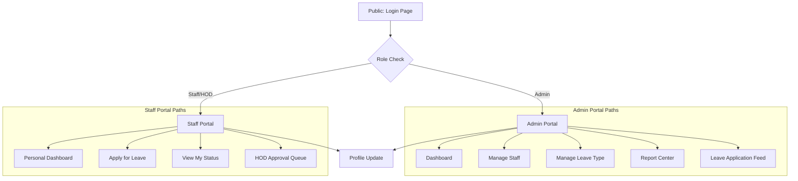

# UI/UX DESIGN DOCUMENT
## Employee Leave Management System
### ELMS v2.0 — Multi-Role Leave Management Web & Desktop Application
**Partnered with VNSGU, Surat  •  Prepared by: Mahek Bhavsar  •  March 2026**

---

## Table of Contents
1. [Project Brief](#1-project-brief)
2. [User Personas](#2-user-personas)
3. [Task Matrix](#3-task-matrix)
4. [Information Architecture](#4-information-architecture)
5. [Visual Style Guide](#5-visual-style-guide)
   - 5.1 [Color Scheme](#51-color-scheme)
   - 5.2 [Typography](#52-typography)
   - 5.3 [Icons](#53-icons)
   - 5.4 [Layout & Grid System](#54-layout--grid-system)

---

## 1. Project Brief
### Introduction / Purpose
The Employee Leave Management System (ELMS) is designed to replace traditional paper-based leave applications with a digital, real-time platform. It centralizes the lifecycle of leave requests — from application and HOD approval to administrative record-keeping — while ensuring data availability through offline synchronization.

### Primary Purposes
- Provide **Admin** with a control panel to manage staff directories, leave policies, and institutional reports.
- Empower **HODs** to review and approve leave requests for their respective departments instantly.
- Give **Staff** a streamlined portal to apply for leave, track status, and manage their personal leave balance.
- Deliver **Offline Resilience** through local data persistence and automatic background sync.

### Goals & Objectives
1. **Centralized Repository**: All employee and leave data stored in a single MongoDB backend.
2. **Role-Based Workflows**: Distinct access paths for Admin, HOD, and Staff.
3. **Automated Validation**: Systematic checking of leave balances before application submission.
4. **Real-Time Sync**: Seamless transition between offline entry and online server updates.
5. **Exportable Intelligence**: Generation of professional leave reports via PDF and Excel formats.

---

## 2. User Personas

### Mahek Bhavsar — Admin — System Administrator
- **Age**: 22
- **Education**: BCA Final Year / Admin Role
- **Goal**: Maintain the system integrity, manage the staff database, and generate monthly reports.
- **Pain Points**: Manual tracking of leave days in physical registers; difficulty in auditing historical leave data.
- **Motivation**: A unified dashboard that shows the institutional status at a glance.

### Harshil — Staff — Teaching Faculty / HOD
- **Age**: 30+
- **Education**: Post-Graduate (MCA/Ph.D.)
- **Goal**: Manage department absences and apply for personal leave without bureaucratic delays.
- **Pain Points**: Lengthy approval chains; no visibility on leave balance until the end of the semester.
- **Motivation**: Digital approvals that can be done from any device, even during lectures.

---

## 3. Task Matrix

### Admin Task Matrix
| Task | Priority | Route |
| :--- | :--- | :--- |
| Add / Edit / Delete Staff Members | HIGH | `/admin-managed-staff` |
| Define Leave Types & Limits (CL, EL) | HIGH | `/admin-leave-type` |
| View All Leave Applications & Status | HIGH | `/admin-leave` |
| Generate Comprehensive Leave Reports | MEDIUM | `/admin-report` |
| Manage Overall System Settings | MEDIUM | `/admin-dashboard` |

### Staff/HOD Task Matrix
| Task | Priority | Route |
| :--- | :--- | :--- |
| Self-Apply for Leave (Upload Docs) | HIGH | `/apply-leave` |
| Review Departmental Leave Requests | HIGH | `/hod-leave-approved` |
| Track Personal Leave Application Status | HIGH | `/staff-view-status` |
| View Personal Leave Balance & History | MEDIUM | `/staff-dashboard` |
| Update Personal Profile Information | LOW | `/profile-update` |

---

## 4. Information Architecture
The application uses a role-based branching architecture with shared login and profile modules.

---

## 5. Visual Style Guide

### 5.1 Color Scheme
Each portal is assigned a distinct "Role Color" to provide immediate visual context.

| Portal | Primary Color | Gradient Application |
| :--- | :--- | :--- |
| **Admin** | `#1e3c72` | **Dark Navy Gradient** (Sidebar & Header) |
| **Staff/HOD** | `#008080` | **Dark Teal Gradient** (Sidebar & Header) |
| **System** | `#f8f9fa` | **Light Neutral Background** (Content Area) |

### 5.2 Typography
- **Primary Font**: 'Inter', sans-serif (via Google Fonts)
- **Base Size**: 14px (Custom override in `styles.css`)

| Weight | Usage |
| :--- | :--- |
| **700 (Bold)** | Page Headers, Section Titles |
| **600 (Semibold)** | Navigation Labels, Table Headers |
| **500 (Medium)** | Body Text |
| **400 (Regular)** | Muted Subtext, Table Contents |

### 5.3 Icons
The project exclusively uses **Bootstrap Icons (v1.11.3)**.

| Component | Icon Class | Usage |
| :--- | :--- | :--- |
| **Dashboard** | `bi bi-speedometer2` | Home/Stats Link |
| **Staff** | `bi bi-people-fill` | Admin Staff Management |
| **Leave** | `bi bi-calendar-check` | Leave Application Related |
| **Settings** | `bi bi-gear-fill` | System Configuration |
| **Status** | `bi bi-hourglass-split` | Pending Applications |
| **Approve** | `bi bi-check-circle` | Approval Actions |

### 5.4 Layout & Grid System
The interface follows a **Fixed Sidebar + Sticky Topbar** layout for maximum efficiency.

- **Sidebar Width**: 260px (Expanded), 70px (Collapsed)
- **Topbar Height**: 68px
- **Card Styling**: `border-0`, `shadow-sm`, `rounded-4` (1rem border-radius)
- **Spacing**: Bootstrap standard `p-3` to `p-4` for desktop density.

---
*Document prepared for: Minor Project — ELMS v2.0*
*Employee Leave Management System  •  Partnered with VNSGU, Surat*
*Prepared by: Mahek Bhavsar  •  March 2026*
